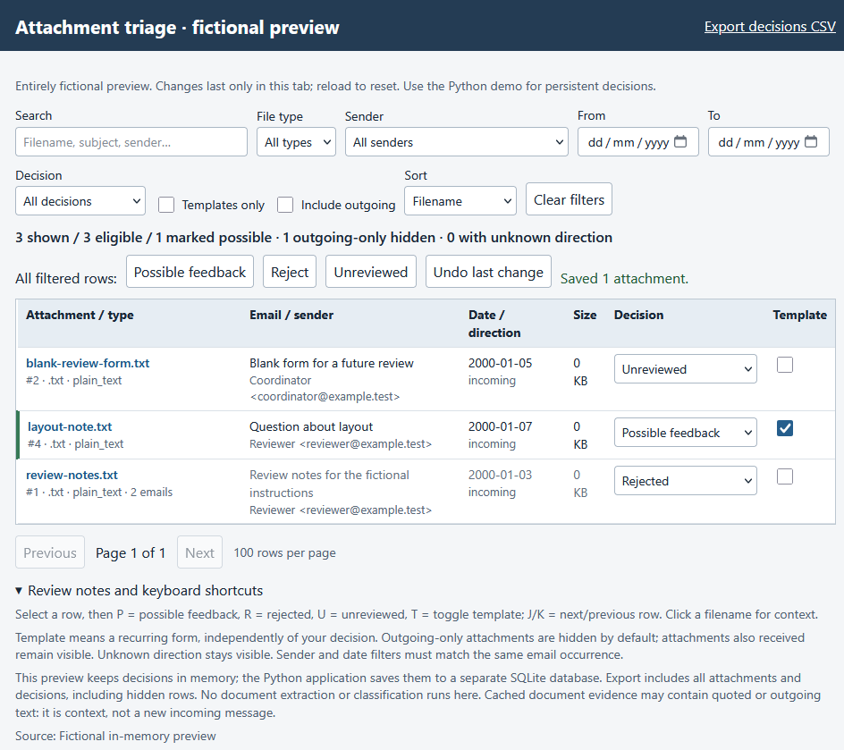

# Feedback: turning correspondence into career evidence

A personal data project for finding useful professional feedback across a large
archive of emails and documents, reviewing it systematically, and turning it
into traceable evidence for job applications.

**[Try the fictional interactive demo](https://quietlytechnical.com/projects/feedback-demo/)**

*An entirely fictional dataset running through the attachment-review interface.*

## What I built

- Python tooling to inventory and process a large mailbox archive
- Local model-assisted candidate discovery and extraction diagnostics
- Review interfaces for conversations and attachments
- Filters, bulk decisions and resumable review state
- SQLite-backed persistence and evidence tracking
- A frozen evidence snapshot preserving source relationships and review decisions
- Two final outputs: an application-facing evidence register and a broader career retrospective

## Why this was harder than a search problem

Useful feedback was scattered across email bodies, document comments and formal review attachments.

Simple keyword matching was not enough. Repeated templates, outgoing messages and administrative acknowledgements could all look relevant without actually supporting a professional claim.

The workflow therefore had to preserve the **source, speaker, context and human review decision** behind every piece of evidence.

## Skills demonstrated

- Python and structured data processing
- Human-in-the-loop QA
- Data provenance and auditability
- SQLite and lightweight web interfaces
- Local AI-assisted workflows
- Technical documentation
- Privacy-conscious publication

## Explore the project

| | |
| --- | --- |
| [Methodology](docs/methodology.md) | Workflow, review rules and evidence boundaries |
| [Lessons learned](docs/lessons-learned.md) | What changed during the project and why |
| [Output design](docs/output-design.md) | Evidence-card design and a fictional worked example |
| [Code provenance](docs/code-provenance.md) | What code is historical, excerpted or newly prepared |
| [Publication boundary](docs/publication-boundary.md) | What is intentionally excluded from the public repository |
| [Fictional data](examples/fictional-feedback.json) | Inspectable source material used for the demo |

## About the public version

This repository is a **project record, not a copy of the private archive**.

The demonstration uses entirely fictional material. Original correspondence, review decisions, evidence cards and career findings remain private.

The included code represents selected parts of the workflow rather than a packaged general-purpose product. The demo accesses no mailbox and makes no external model or API requests.

## AI use

AI tools assisted with code development, candidate discovery and synthesis work. I defined the review categories, evidence rules and workflow, made the final evidence decisions, and decided where automation was and was not appropriate.